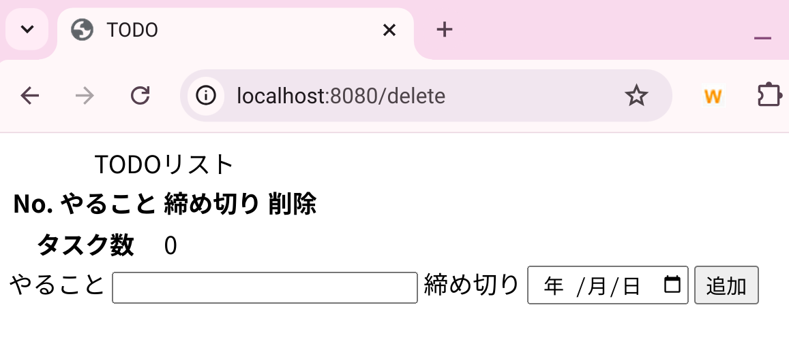
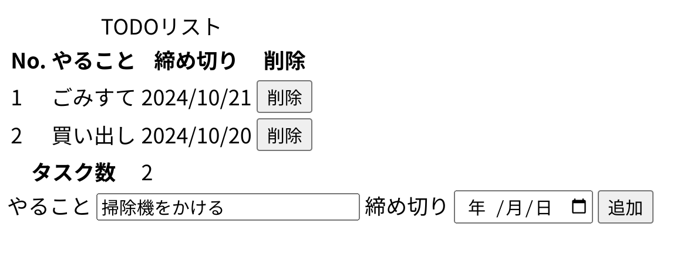

# TODOアプリ

## これは何？

技術書典オンラインマーケットで頒布中の同人誌『Java書けるようになった！ …えっと、それから？？？』のおまけのサンプルアプリです。

- 頒布ページ
  - https://techbookfest.org/product/fEkBY40CCT4tv8Rb6whRuz

## 起動方法

- このリポジトリから自分のリポジトリにForkする
  - 参考：https://qiita.com/morioka1206/items/6f777c060b88f4a7f3ce
- 自分のリポジトリから自分の端末のローカルにCloneする
  - 参考：同上
- Gradleの初回実行が終わるのを待つ
- 実行する
  - 参考
    - IntelliJ IDEA：https://qiita.com/dengxinrong/items/6f939b810a392940571b#bootrun
    - Eclipse：https://qiita.com/miz21358/items/ae61ebdcbb9d8760e62b#4--gradle%E3%81%AEbootrun%E3%81%A7%E5%AE%9F%E8%A1%8C%E3%81%99%E3%82%8B
    - VSCode：https://zenn.dev/penguin_z/articles/9ac655983f8eda#%E3%81%A7%E3%81%AF%E3%80%81%E3%82%A2%E3%83%97%E3%83%AA%E3%82%92%E5%8B%95%E3%81%8B%E3%81%97%E3%81%A6%E3%81%BF%E3%82%88%E3%81%86
- アプリを起動してブラウザで `http://localhost:8080` にアクセスすると、初期画面が見れます
  - 

## 機能

- 初期画面から「やること」欄に文字列を、「締め切り」欄に日付を入力して「追加」ボタンを押下すると、TODOを登録でき、一覧に表示されます
  - 
- 登録後に一覧の「削除」ボタンを押下すると、当該TODOを削除できます
